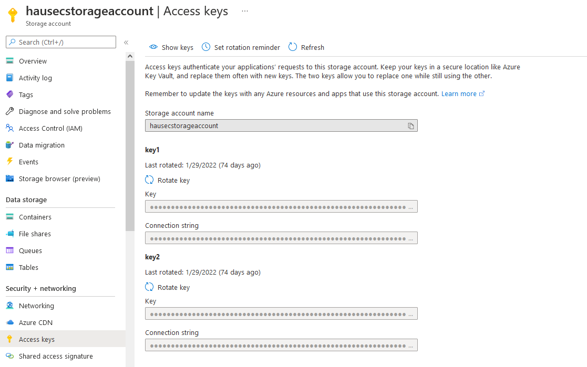

# AZT605.1 - Resource Secret Reveal: Storage Account Access Key Dumping

By accessing a Storage Account, an adversary may dump access keys pertaining to the Storage Account, which will give them full access to the Storage Account.

!!! info "Resource" 

	Azure Storage Account

!!! success "Actions"

	* Microsoft.Storage/storageAccounts/listkeys/action

!!! example "Examples"

    === "Az PowerShell"

		[`#!powershell Get-AzStorageAccountKey`](https://docs.microsoft.com/en-us/powershell/module/az.storage/get-azstorageaccountkey?view=azps-8.0.0)

	=== "Azure CLI"
	
		[`#!python az storage account keys`](https://docs.microsoft.com/en-us/cli/azure/storage/account/keys?view=azure-cli-latest)

	=== "Azure REST API"
	
		[`#!python https://{myaccount}.blob.core.windows.net/?restype=service&comp=userdelegationkey`](https://docs.microsoft.com/en-us/rest/api/storageservices/get-user-delegation-key)	

    === "Azure Portal"

		

!!! abstract "Detections"

	## **Logs** 

    | Data Source        | Operation Name     | Action                                                            | Log Provider |
    |--------------------|---------------------|-------------------------------------------------------------------|--------------|
    | Resource | MICROSOFT.STORAGE/STORAGEACCOUNTS/LISTKEYS/ACTION	 | Microsoft.Storage/storageAccounts/listkeys/action	| AzureActivity |

	## **Queries**

	| Platform | Query |
    |----------|-------|
	| Log Analytics | `#!sql AzureActivity | where OperationNameValue == 'MICROSOFT.STORAGE/STORAGEACCOUNTS/LISTKEYS/ACTION' and ActivityStatusValue == 'Start'` |	
	
	## **Azure Monitor Alert**
	
	
!!! faq "Additional Resources"

	[https://docs.microsoft.com/en-us/azure/storage/common/storage-account-keys-manage?tabs=azure-portal](https://docs.microsoft.com/en-us/azure/storage/common/storage-account-keys-manage?tabs=azure-portal)
