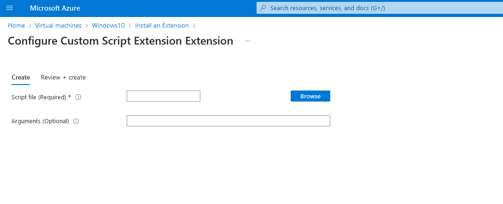

# AZT301.2 - Virtual Machine Scripting: CustomScriptExtension

By utilizing the 'CustomScriptExtension' extension on a Virtual Machine, an attacker can pass PowerShell commands to the VM as SYSTEM.

!!! info "Resource" 

	* Virtual Machine
	* Virtual Machine Scale Sets
	* Azure ARC 

!!! success "Actions"

	* Microsoft.Compute/virtualMachines/extensions/*
	* Microsoft.Compute/virtualMachines/write

!!! example "Examples"

    === "Az PowerShell"
		[`#!powershell Set-AzVMCustomScriptExtension`](https://docs.microsoft.com/en-us/powershell/module/az.compute/set-azvmcustomscriptextension?view=azps-8.0.0)
		
    === "Azure CLI"
        [`#!powershell az vm extension set`](https://docs.microsoft.com/en-us/cli/azure/vm/extension?view=azure-cli-latest#az-vm-extension-set)
		
    === "Azure REST API"	
		[`#!powershell PUT https://management.azure.com/subscriptions/{subscription-id}/resourceGroups/{rg name}/providers/Microsoft.Compute/virtualMachines/{vm name]/extensions/CustomScriptExtension?api-version=2022-03-01`](https://docs.microsoft.com/en-us/rest/api/compute/virtual-machine-extensions/create-or-update)

    === "Azure Portal"
    	

!!! abstract "Detections"

	## **Detection Details**

	The commands are stored as .PS1 files and deleted after running.

	## **Logs** 

    | Data Source        | Operation Name     | Action/On-Disk Location                                             | Log Provider |
    |--------------------|---------------------|-------------------------------------------------------------------|--------------|
    | Resource  | Create or Update Virtual Machine Extension	 | Microsoft.Compute/virtualMachines/extensions/write | AzureActivity |
	| On-Resource File    | File Creation       | C:\Packages\Plugins\Microsoft.Compute.CustomScriptExtension\1.9.5\Downloads | Event |
	| On-Resource File    | File Creation       | C:\Packages\Plugins\Microsoft.Compute.CustomScriptExtension\1.9.5\Status | Event |
	
	## **Queries**

	| Platform | Query |
    |----------|-------|
	| Log Analytics | `#!sql let timeframe = toscalar(AzureActivity | where OperationNameValue == 'MICROSOFT.COMPUTE/VIRTUALMACHINES/EXTENSIONS/WRITE' and Properties has 'CustomScriptExtension' | distinct TimeGenerated); Event | where EventID  == '4104' | where (timeframe - TimeGenerated) <= 1m` |
	| Log Analytics | `#!sql AzureActivity | where OperationNameValue == 'MICROSOFT.COMPUTE/VIRTUALMACHINES/EXTENSIONS/WRITE' and Properties has 'CustomScriptExtension'`
		
	## **Azure Monitor Alert**
	
	For resources *with* Azure Monitor Agent installed
	
	

	For resources *without* Azure Monitor Agent installed
	
	
	
!!! faq "Additional Resources"

	* [https://docs.microsoft.com/en-us/azure/virtual-machines/extensions/custom-script-windows](https://docs.microsoft.com/en-us/azure/virtual-machines/extensions/custom-script-windows)
	* [https://docs.microsoft.com/en-us/azure/virtual-machines/extensions/custom-script-linux](https://docs.microsoft.com/en-us/azure/virtual-machines/extensions/custom-script-linux)