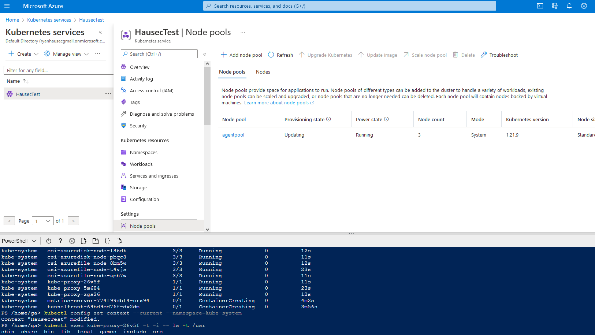

# AZT301.5 - Virtual Machine Scripting: AKS Command Invoke

By utilizing 'command invoke' on an Azure Kubernetes Service (AKS) cluster, an attacker can pass commands to the cluster's VM as SYSTEM

!!! info "Resource" 

	Azure Kubernetes Service

!!! success "Actions" 

	* Microsoft.ContainerService/managedClusters/runcommand/action
	* Microsoft.ContainerService/managedclusters/commandResults/read

!!! example "Examples"

    === "Az PowerShell"
		[`#!powershell Invoke-AzAksRunCommand`](https://docs.microsoft.com/en-us/powershell/module/az.aks/invoke-azaksruncommand?view=azps-8.0.0)
		
    === "Azure CLI"
        [`#!powershell az aks command invoke`](https://docs.microsoft.com/en-us/cli/azure/aks/command?view=azure-cli-latest)
		
    === "Azure REST API"	
		[`#!powershell POST https://management.azure.com/subscriptions/{subscriptionId}/resourceGroups/{resourceGroupName}/providers/Microsoft.ContainerService/managedClusters/{resourceName}/runCommand?api-version=2022-04-01`](https://docs.microsoft.com/en-us/rest/api/aks/managed-clusters/run-command)

    === "Azure Portal"
    	
 
!!! abstract "Detections"

	## **Detection Details**
	
	Logs are only generated when running a command through az cli or Az PowerShell. Using `kubectl` will not generate logs.

	## **Logs** 

    | Data Source        | Operation Name     | Action                                                            | Log Provider |
    |--------------------|---------------------|-------------------------------------------------------------------|--------------|
    | Resource | RunCommand	 | Microsoft.ContainerService/managedClusters/runCommand/action	| AzureActivity |

	## **Queries**

	| Platform | Query |
    |----------|-------|
	| Log Analytics | `#!sql AzureActivity | where OperationNameValue == 'MICROSOFT.CONTAINERSERVICE/MANAGEDCLUSTERS/RUNCOMMAND/ACTION'`|

	## **Azure Monitor Alert**
	
	

!!! faq "Additional Resources"

	[https://docs.microsoft.com/en-us/azure/aks/command-invoke](https://docs.microsoft.com/en-us/azure/aks/command-invoke)
