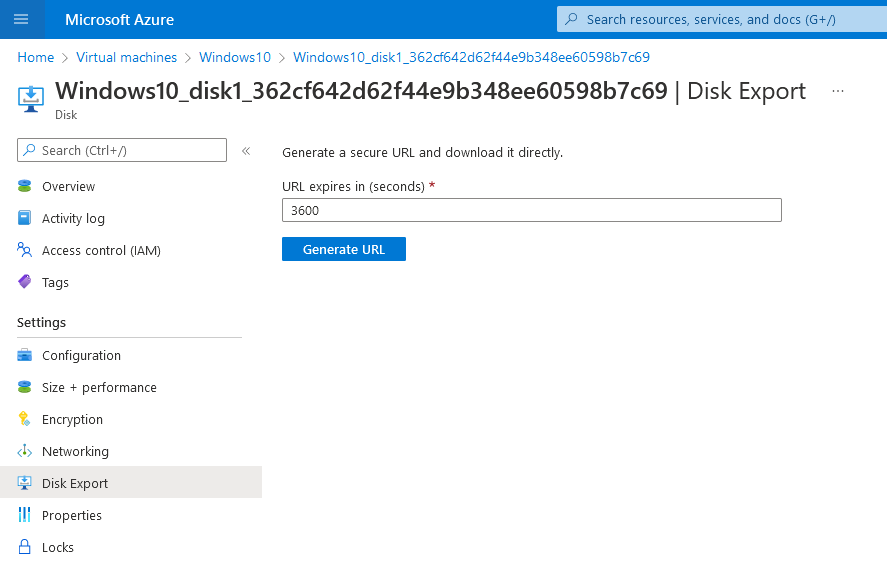

# AZT701.1 - SAS URI Generation: VM Disk SAS URI

An adversary may create an SAS URI to download the disk attached to a virtual machine.

!!! info "Resource"

	Virutal Machine Disk

!!! success "Actions" 

	* Microsoft.Compute/disks/beginGetAccess/action

!!! example "Examples"

    === "Az PowerShell"
	
    	* [`#!powershell New-AzureStorageBlobSASToken`](https://docs.microsoft.com/en-us/powershell/module/azure.storage/new-azurestorageblobsastoken?view=azurermps-6.13.0)
		
    	* [`#!powershell New-AzStorageContainerSASToken`](https://docs.microsoft.com/en-us/powershell/module/az.storage/new-azstoragecontainersastoken?view=azps-8.0.0)
		
	=== "Azure CLI"
		[`#!python az storage blob generate-sas`](https://docs.microsoft.com/en-us/cli/azure/storage/blob?view=azure-cli-latest#az-storage-blob-generate-sas)

	=== "Azure Portal"

		

!!! abstract "Detections"

	## **Logs** 

    | Data Source        | Operation Name     | Action                                                            | Log Location |
    |--------------------|---------------------|-------------------------------------------------------------------|--------------|
    | Resource | Get Disk SAS URI	 | Microsoft.Compute/disks/BeginGetAccess/action	| Azure Activity Log |
    
    ## ** Queries**


	=== "Log Analytics"
	```AzureActivity 
 	|where OperationNameValue=~"Microsoft.Compute/disks/BeginGetAccess/action"
	```


!!! faq "Additional Resources"

	[https://docs.microsoft.com/en-us/azure/marketplace/azure-vm-get-sas-uri](https://docs.microsoft.com/en-us/azure/marketplace/azure-vm-get-sas-uri)
