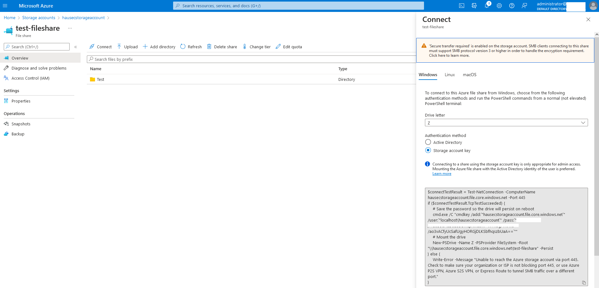

# AZT702.1 - File Share Mounting: Storage Account File Share NFS/SMB Mount

An adversary can generate a connection string to mount an Azure Storage Account File Share as an NFS or SMB share to their local machine.

!!! info "Resource" 

	Azure Storage Account

!!! success "Actions"

	* Microsoft.Storage/storageAccounts/fileServices/shares/write

!!! example "Examples"

    === "Azure Portal"
	
    	

!!! abstract "Detections"

	Connection logs to the share are not generated in Azure.

!!! faq "Additional Resources"

	[https://docs.microsoft.com/en-us/azure/storage/files/files-smb-protocol?tabs=azure-portal](https://docs.microsoft.com/en-us/azure/storage/files/files-smb-protocol?tabs=azure-portal)
