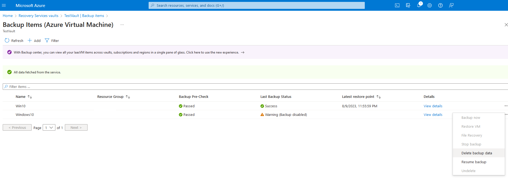

# AZT705 - Azure Backup Delete

An adversary may delete data within the Recovery Service Vault, which houses backup data.

!!! info "Resource" 

	Recovery Service Vaults
	
!!! success "Actions"

	* Microsoft.RecoveryServices/Vaults/delete
	
	* Microsoft.RecoveryServices/Vaults/read

!!! example "Examples"

    === "Az PowerShell"
		* [`#!powershell Remove-AzRecoveryServicesVault`](https://learn.microsoft.com/en-us/powershell/module/az.recoveryservices/remove-azrecoveryservicesvault?view=azps-10.2.0)

						
	=== "Azure CLI"
		* [`#!python az backup vault delete`](https://learn.microsoft.com/en-us/cli/azure/backup/vault?view=azure-cli-latest#az-backup-vault-delete)
		
		
    === "Azure Portal"
    	

!!! abstract "Detections"

	## **Logs** 

    | Data Source        | Operation Name      | Action                                                            | Log Provider |
    |--------------------|---------------------|-------------------------------------------------------------------|--------------|
    | Resource           | Delete	 | Microsoft.RecoveryServices/Vaults/delete| AzureActivity |       

	## **Queries**

	| Platform | Query |
    |----------|-------|
	| Log Analytics | `#!sql AzureActivity | where ResourceProviderValue == "MICROSOFT.RECOVERYSERVICES" and OperationNameValue contains "Delete" ` |	

	
!!! faq "Additional Resources"
