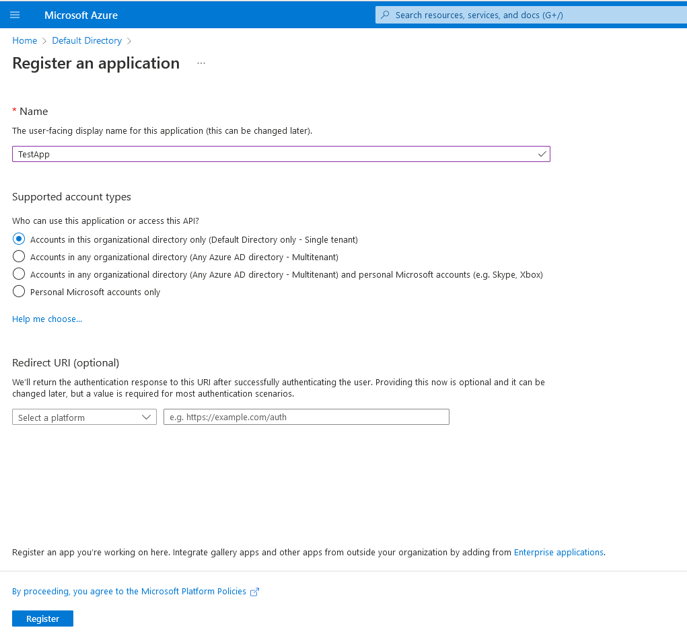

# AZT502.2 - Account Creation: Service Principal Creation

An adversary may create an application & service principal in Azure Active Directory

!!! info "Resource" 

	Azure Active Directory

!!! success "Actions"

	* microsoft.directory/servicePrincipals/create
	* microsoft.directory/applications/create

!!! example "Examples"

    === "Az PowerShell"

    	[`#!powershell New-AzADServicePrincipal`](https://docs.microsoft.com/en-us/powershell/module/az.resources/new-azadserviceprincipal?view=azps-8.0.0)

	=== "Azure CLI"
	
		[`#!python az ad sp create`](https://docs.microsoft.com/en-us/cli/azure/ad/sp?view=azure-cli-latest#az-ad-sp-create)

	=== "Microsoft Graph API"
	
		[`#!python POST https://graph.microsoft.com/v1.0/servicePrincipals`](https://docs.microsoft.com/en-us/graph/api/serviceprincipal-post-serviceprincipals?view=graph-rest-1.0&tabs=http)	

    === "Azure Portal"
	
    	
 
!!! abstract "Detections"

	## **Logs** 

	| Data Source        | Operation Name     | Action                                                            | Log Provider |
	|--------------------|---------------------|-------------------------------------------------------------------|--------------|
	| Azure Active Directory | Add service principal	 | microsoft.directory/servicePrincipals/create	|  AuditLogs |
	| Azure Active Directory | Add application | microsoft.directory/applications/create	| AuditLogs |
	| Azure Active Directory | Add owner to application | microsoft.directory/servicePrincipals/owners/update	| AuditLogs |

	## **Queries**

	| Platform | Query |
    |----------|-------|
	| Log Analytics | `#!sql AuditLogs | where OperationName == 'Add service principal'` |	
	
	## **Azure Monitor Alert**
	
	
!!! faq "Additional Resources"

	[https://docs.microsoft.com/en-us/azure/active-directory/develop/app-objects-and-service-principals](https://docs.microsoft.com/en-us/azure/active-directory/develop/app-objects-and-service-principals)
