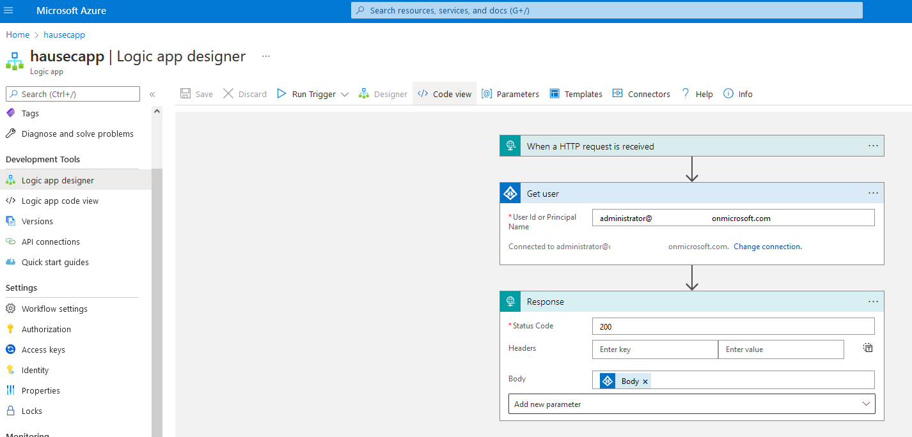
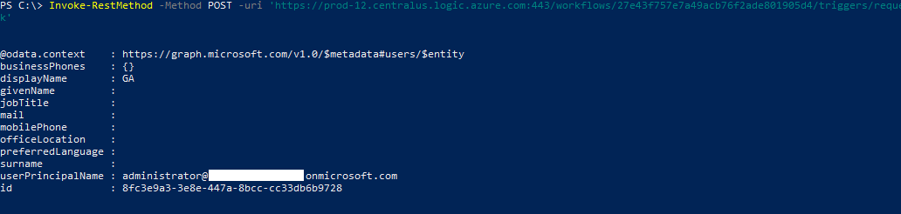

# AZT503.1 - HTTP Trigger: Logic Application HTTP Trigger

Adversaries may configure a Logic Application with a user account or managed identity and modify the HTTP trigger to run a command via HTTP request.

!!! info "Resource" 

	 Logic Application

!!! success "Actions"

	* Microsoft.Logic/workflows/write
	* Microsoft.Logic/workflows/run/action
	* Microsoft.Logic/operations/read

!!! example "Examples"

    === "Az PowerShell"

		[`#!powershell Set-AzLogicApp`](https://docs.microsoft.com/en-us/powershell/module/az.logicapp/set-azlogicapp?view=azps-8.0.0)
		
	=== "Azure CLI"
	
		[`#!python az logicapp start`](https://docs.microsoft.com/en-us/cli/azure/logicapp?view=azure-cli-latest#az-logicapp-start)	

	=== "Azure REST API"
	
		[`#!python PUT https://management.azure.com/subscriptions/{subscriptionId}/resourceGroups/{resourceGroupName}/providers/Microsoft.Logic/workflows/{workflowName}?api-version=2016-06-01`](https://docs.microsoft.com/en-us/rest/api/logic/workflows/create-or-update)	

    === "Azure Portal"
    	
    	

!!! abstract "Detections"

	## **Logs** 

	| Data Source        | Operation Name     | Action                                                            | Log Provider |
	|--------------------|---------------------|-------------------------------------------------------------------|--------------|
	| Resource | Gets workflow recommend operation groups	 | Microsoft.Logic/locations/workflows/recommendOperationGroups/action	| AzureActivity |
	| Resource | List Trigger Callback URL | Microsoft.Logic/workflows/triggers/listCallbackUrl/action	| AzureActivity |
	| Resource | Add or Update Connection	| Microsoft.Web/connections/write	| AzureActivity  |

	## **Queries**

	| Platform | Query |
    |----------|-------|
	| Log Analytics | `#!sql AzureActivity | where OperationNameValue=='Microsoft.Logic/locations/workflows/recommendOperationGroups/action' or OperationNameValue=='Microsoft.Logic/workflows/triggers/listCallbackUrl/action' or OperationNameValue=='Microsoft.Web/connections/write'` |	
	
	## **Azure Monitor Alert**
	
	
!!! faq "Additional Resources"

	[https://docs.microsoft.com/en-us/azure/logic-apps/logic-apps-overview](https://docs.microsoft.com/en-us/azure/logic-apps/logic-apps-overview)