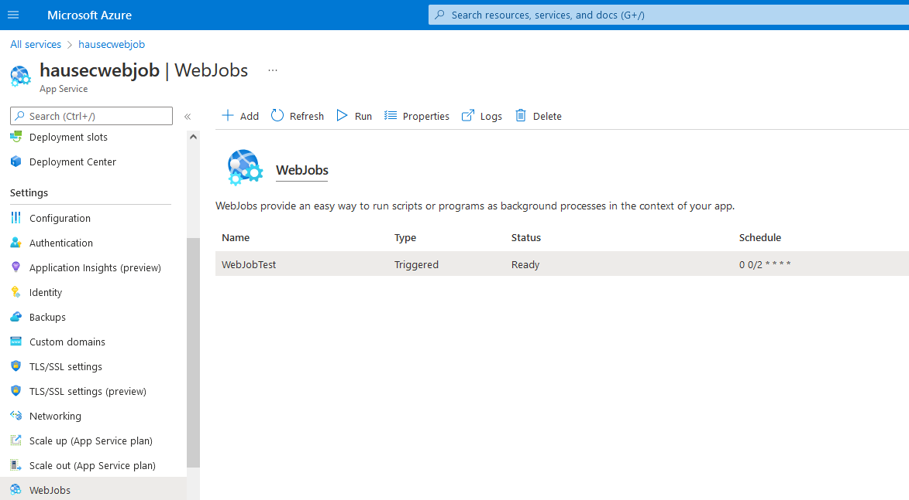

# AZT503.4 - HTTP Trigger: WebJob

Adversaries may create a WebJob on a App Service which allows arbitrary background tasks to be run on a set schedule

!!! info "Resource" 

	App Service

!!! success "Actions"

	* Microsoft.Web/sites/Write

!!! example "Examples"

    === "Az PowerShell"
    	[`#!powershell Start-AzWebAppTriggeredWebJob`](https://docs.microsoft.com/ru-ru/powershell/module/az.websites/start-azwebapptriggeredwebjob?view=azps-8.0.0&viewFallbackFrom=azps-7.4.0)

	=== "Azure CLI"
	
		[`#!python az webapp webjob triggered`](https://docs.microsoft.com/en-us/cli/azure/webapp/webjob/triggered?view=azure-cli-latest)

	=== "Azure REST API"
	
		[`#!python PUT https://management.azure.com/subscriptions/{subscriptionId}/resourceGroups/{resourceGroupName}/providers/Microsoft.Web/sites/{name}/triggeredwebjobs/{webJobName}/run?api-version=2021-02-01`](https://docs.microsoft.com/en-us/rest/api/appservice/web-apps/run-triggered-web-job)	

    === "Azure Portal"
    	

!!! abstract "Detections"

	## **Detection Details**

	To enable logging on AppServices, a Diagnostic setting must be enabled to send logs to an aggregator. In addition, App Service Logs should be enabled.

	WebJob output logs can be viewed on the web application in the format: https://{WEBAPPNAME}.scm.azurewebsites.net/azurejobs/#/jobs/

	## **Detection Screenshot**

	=== "Web Job Logs"
		

	=== "Application Logs"
		

!!! faq "Additional Resources"

	* [https://github.com/Azure/azure-webjobs-sdk/wiki#documentation](https://github.com/Azure/azure-webjobs-sdk/wiki#documentation)
	* [https://docs.microsoft.com/en-us/azure/app-service/webjobs-create](https://docs.microsoft.com/en-us/azure/app-service/webjobs-create)
