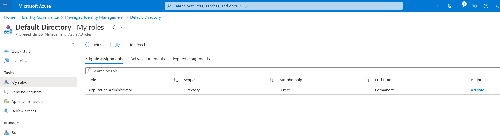
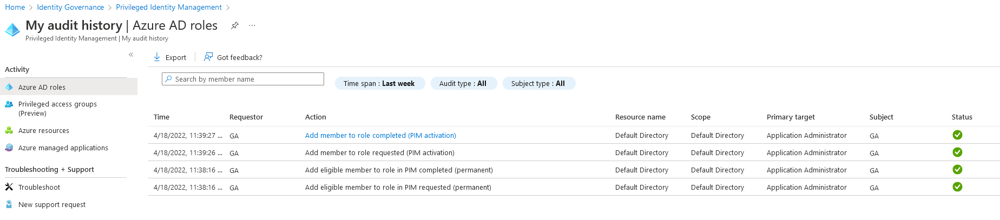

# AZT401 - Privileged Identity Management Role

An adversary may escalate their privileges if their current account is eligible for role activation via Privileged Identity Management (PIM).

!!! info "Resource" 

	* Azure Active Directory
	* Azure Resources

!!! success "Actions"

	* RoleManagement.ReadWrite.Directory
	* RoleManagement.Read.Directory

!!! example "Examples"

    === "AzureAD PowerShell"
		[`#!powershell Open-AzureADMSPrivilegedRoleAssignmentRequest`](https://docs.microsoft.com/en-us/powershell/module/azuread/open-azureadmsprivilegedroleassignmentrequest?view=azureadps-2.0-preview)
 
	=== "Microsoft Azure Graph API"	
		[`#!powershell GET https://graph.microsoft.com/beta/roleManagement/directory/roleEligibilitySchedules/313af44a-07c9-43a7-9970-5072a6b5591f`](https://docs.microsoft.com/en-us/graph/api/unifiedroleeligibilityschedule-get?view=graph-rest-beta&tabs=http)

	=== "Azure REST API"	
		[`#!powershell GET https://management.azure.com/{scope}/providers/Microsoft.Authorization/roleEligibilityScheduleRequests/{roleEligibilityScheduleRequestName}?api-version=2020-10-01`](https://docs.microsoft.com/en-us/rest/api/authorization/role-eligibility-schedule-requests/get)

    === "Azure Portal"
    	
 
!!! abstract "Detections"

	## **Logs**

	| Data Source        | Operation Name     | Action                                                            | Log Provider |
	|--------------------|---------------------|-------------------------------------------------------------------|--------------|
	| Azure Active Directory | Add member to role requested (PIM activation)	 | RoleManagement.ReadWrite.Directory	| PIM Audit Logs |
	| Azure Active Directory | Add member to role completed (PIM activation)	 | RoleManagement.ReadWrite.Directory	| PIM Audit Logs  |
	| Azure Active Directory | Add eligible member to role in PIM completed (permanent)	| RoleManagement.ReadWrite.Directory| PIM Audit Logs  |
	| Azure Active Directory | Add eligible member to role in PIM requested (permanent)	| RoleManagement.ReadWrite.Directory	| PIM Audit Logs  |

	## **Detection Screenshots**
    
	

!!! faq "Additional Resources"

	* [https://docs.microsoft.com/en-us/azure/active-directory/privileged-identity-management/pim-configure](https://docs.microsoft.com/en-us/azure/active-directory/privileged-identity-management/pim-configure)
	* [https://docs.microsoft.com/en-us/azure/active-directory/privileged-identity-management/powershell-for-azure-ad-roles](https://docs.microsoft.com/en-us/azure/active-directory/privileged-identity-management/powershell-for-azure-ad-roles)
	* [https://docs.microsoft.com/en-us/azure/active-directory/privileged-identity-management/pim-apis](https://docs.microsoft.com/en-us/azure/active-directory/privileged-identity-management/pim-apis)
