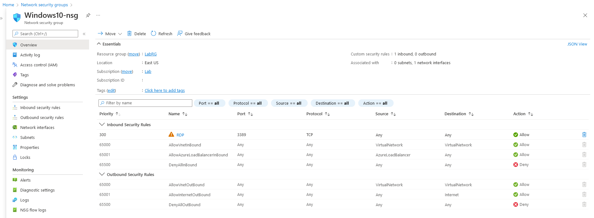

# AZT101 - Port Mapping

It is possible to view the open ports on a virtual machine by viewing the Virtual Network Interface's assigned Network Security Group

!!! info "Resource" 

	 Network Security Group

!!! success "Actions"

	* Microsoft.Network/networkSecurityGroups/read

!!! example "Examples"

    === "Az PowerShell"	
		[`#!powershell Get-AzNetworkSecurityGroup`](https://docs.microsoft.com/en-us/powershell/module/az.network/get-aznetworksecuritygroup?view=azps-8.0.0)

	=== "Azure CLI"	
		[`#!powershell az network nsg show`](https://docs.microsoft.com/en-us/cli/azure/network/nsg?view=azure-cli-latest#az-network-nsg-show)
		
	=== "Azure REST API"	
		[`#!http GET https://management.azure.com/subscriptions/{subscriptionId}/resourceGroups/{resourceGroupName}/providers/Microsoft.Network/networkSecurityGroups/{networkSecurityGroupName}?api-version=2021-08-01`](https://docs.microsoft.com/en-us/rest/api/virtualnetwork/network-security-groups/get#code-try-0)

	=== "Azure Portal"
    		

!!! abstract "Detections"

	N/A

!!! faq "Additional Resources"

	[https://docs.microsoft.com/en-us/azure/virtual-network/network-security-groups-overview](https://docs.microsoft.com/en-us/azure/virtual-network/network-security-groups-overview)

