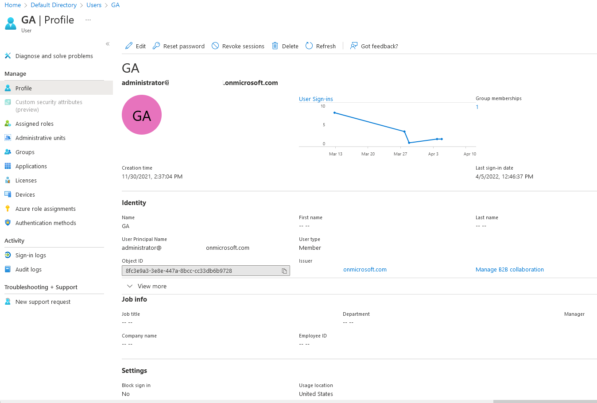

# AZT104 - Gather User Information

An adversary may obtain information about a User within Azure Active Directory. Details may include email addresses, first/last names, job information, addresses, and assigned roles. By default, all users are able to read other user's roles and group memberships within AAD.

!!! info "Resource" 

	Azure Active Directory

!!! success "Actions"

	* microsoft.directory/\*/*/read

!!! example "Examples"

    === "Az PowerShell"	
		[`#!powershell Get-AzADUser`](https://docs.microsoft.com/en-us/powershell/module/az.resources/get-azaduser?view=azps-8.0.0)
		
    === "Azure CLI"	
		[`#!powershell az ad user show`](https://docs.microsoft.com/en-us/cli/azure/ad/user?view=azure-cli-latest#az-ad-user-show)

    === "Microsoft Graph REST API"	
		[`#!powershell GET https://graph.microsoft.com/v1.0/users/{id | userPrincipalName}`](https://docs.microsoft.com/en-us/graph/api/user-get?view=graph-rest-1.0&tabs=http)

    === "Azure Portal"
    	
 
!!! abstract "Detections"

	N/A

!!! faq "Additional Resources"

	[https://docs.microsoft.com/en-us/azure/active-directory/fundamentals/users-default-permissions](https://docs.microsoft.com/en-us/azure/active-directory/fundamentals/users-default-permissions)
